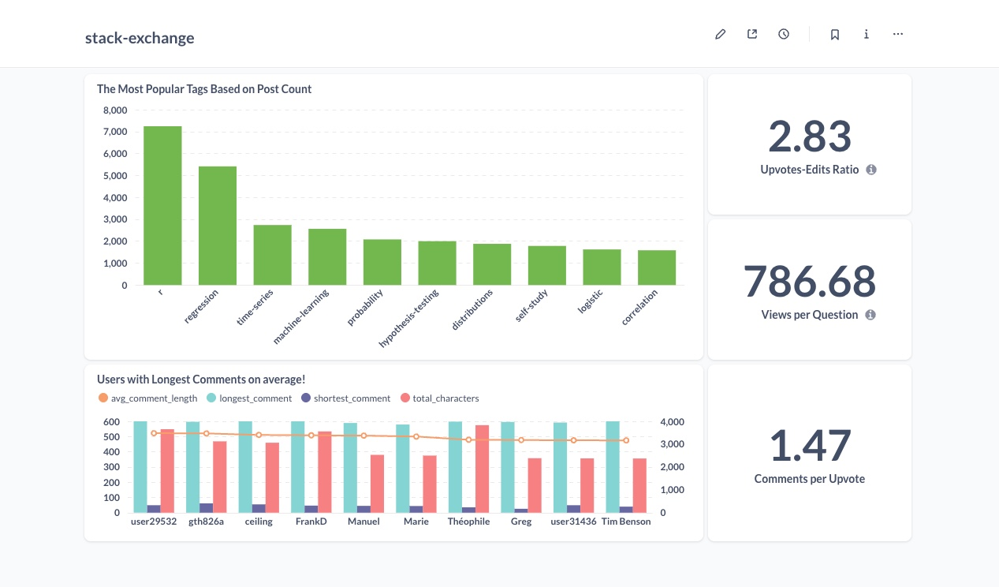

# Stack Exchange Analytics Project

A comprehensive data analytics solution for Stack Exchange data using Data Vault modeling, featuring ETL processes, analytics, and multiple visualization interfaces. This project demonstrates the implementation of a complete data pipeline from raw data to interactive dashboards using modern data engineering practices.

## Project Overview

This project implements a full-scale analytics solution with:
- Data Vault 2.0 modeling for robust data warehousing
- Automated ETL pipeline for data transformation
- Dual visualization platforms:
  - Real-time Streamlit dashboard with comprehensive analytics
  - Metabase dashboard focusing on key business metrics


*Metabase dashboard showing 3 key performance indicators and 2 business questions. A more comprehensive set of analytics is available through the Streamlit dashboard.*

### Key Features
- **Data Vault Implementation**: Robust and scalable data modeling
- **Dual Visualization Platforms**:
  - **Metabase**: Quick insights with 3 KPIs and 2 business questions
  - **Streamlit**: Comprehensive analytics with:
    - User engagement metrics
    - Content quality analysis
    - Tag popularity trends
    - Response time analytics
    - Comment quality metrics
- **Automated Data Pipeline**: From raw CSV files to processed analytics
- **Docker Containerization**: Easy deployment and scaling

## Project Structure

```
.
├── etl/
│   ├── etl.py              # ETL process implementation
│   ├── file_handler.py     # File operations handler
│   └── database_management.py  # Database schema and operations
├── analytics/
│   ├── analytics_utilities.py  # Analytics functions and database queries
│   └── run_analytics.py     # Processes data for visualizations
├── streamlit_app.py        # Interactive web dashboard
├── docker-compose.yml      # Docker services configuration
├── Dockerfile             # Application container definition
├── requirements.txt       # Python dependencies
└── README.md             # Project documentation
```

## Prerequisites

Before starting, ensure you have:

1. **Docker and Docker Compose** installed on your system
   - For Mac: Docker Desktop
   - For Windows: Docker Desktop with WSL 2
   - For Linux: Docker Engine and Docker Compose

2. **Stack Exchange Data Files**
   Required files can be downloaded from:
   [Stack Exchange Data Files](https://cloudstorage.elearning.uni-oldenburg.de/s/ysmCtZCm3zDYb4r)

   After downloading, place the following files in the `stack-exchange-data/` directory:
   - badges.csv
   - comments.csv
   - posts.csv
   - tags.csv
   - users.csv
   - votes.csv
   - postLinks.csv

3. **System Requirements**
   - Minimum 8GB RAM
   - 10GB free disk space
   - Internet connection for pulling Docker images

## Initial Setup

1. **Clone the Repository**
   ```bash
   git clone <repository-url>
   cd bi_mini_project
   ```

2. **Create Environment Files**

   Create `.env` file with the following content:
   ```bash
   STACK_USER=stack_db
   STACK_PASSWORD=your_secure_password
   STACK_NAME=stack_db
   STACK_PORT=5432
   STACK_URL=postgres
   ```

   Create `config.ini` file with:
   ```ini
   [PostgreSQL]
   STACK_USER = stack_db
   STACK_URL = postgres
   STACK_PORT = 5432
   STACK_NAME = stack_db
   ```

3. **Data Preparation**
   - Create directory: `mkdir stack-exchange-data`
   - Place all CSV files in the `stack-exchange-data/` directory
   - Ensure file permissions: `chmod 644 stack-exchange-data/*.csv`

## Running the Application

1. **Start the Services**
   ```bash
   docker-compose up -d
   ```

   This will start all services in the following order:
   - PostgreSQL (database)
   - ETL (data loading)
   - Analytics (data processing)
   - Streamlit (visualization dashboard)
   - Metabase (BI platform)

2. **Service Startup Times**
   - PostgreSQL: ~10-15 seconds
   - ETL process: 2-5 minutes (depending on data size)
   - Analytics: 1-2 minutes
   - Streamlit: Immediate
   - Metabase: 2-3 minutes for first initialization

## Accessing the Services

1. **Streamlit Dashboard**
   - URL: http://localhost:8501
   - No authentication required
   - Provides real-time analytics visualizations

2. **Metabase Setup**
   - URL: http://localhost:3000
   - First-time setup:
     1. Create admin account
     2. Add database connection with these credentials:
        ```
        Display name: stack_db
        Host: postgres
        Port: 5432
        Database name: stack_db
        Username: stack_db
        Password: 24584040
        ```
     3. Select "All" for schemas
     4. Test connection before saving

## Troubleshooting Guide

### Common Issues and Solutions

1. **PostgreSQL Port Conflict**
   ```
   Error: bind: address already in use
   ```
   Solution:
   - The default PostgreSQL port (5432) is already in use
   - We've configured to use port 5433 externally
   - No action needed as docker-compose.yml already handles this

2. **Missing Data Files**
   ```
   FileNotFoundError: [Errno 2] No such file or directory
   ```
   Solution:
   - Ensure all CSV files are in `stack-exchange-data/` directory
   - Check file permissions
   - Verify file names match exactly (case-sensitive)

3. **Metabase Database Connection Issues**
   ```
   Connection refused or Authentication failed
   ```
   Solution:
   - Wait for PostgreSQL to fully initialize (~15 seconds)
   - Verify credentials in docker-compose.yml match .env file
   - Use `postgres` as hostname (not localhost)

4. **Streamlit Import Errors**
   ```
   ModuleNotFoundError: No module named 'analytics_utilities'
   ```
   Solution:
   - Verify PYTHONPATH in Dockerfile is set to `/app`
   - Check if analytics module is properly installed
   - Restart Streamlit container: `docker-compose restart streamlit`

5. **Memory Issues**
   ```
   Container killed due to memory limit
   ```
   Solution:
   - Increase Docker memory limit in Docker Desktop settings
   - Recommended: At least 4GB for Docker

### Monitoring and Logs

1. **View Service Logs**
   ```bash
   # All services
   docker-compose logs

   # Specific service
   docker-compose logs [service_name]

   # Follow logs
   docker-compose logs -f [service_name]
   ```

2. **Check Service Status**
   ```bash
   docker-compose ps
   ```

3. **Restart Services**
   ```bash
   # Restart all
   docker-compose restart

   # Restart specific service
   docker-compose restart [service_name]
   ```

## Data Flow Architecture

1. **ETL Process**
   - Reads CSV files from `stack-exchange-data/`
   - Transforms into Data Vault 2.0 model
   - Loads into PostgreSQL database

2. **Analytics Layer**
   - Processes raw data into analytics-ready format
   - Calculates KPIs and metrics
   - Stores results for visualization

3. **Visualization Layer**
   - Streamlit: Real-time interactive dashboards
   - Metabase: Custom BI dashboards and exploration

## Security Notes

1. **Database Credentials**
   - Stored in `.env` file (not committed to version control)
   - Used by all services through Docker environment variables

2. **Port Exposure**
   - PostgreSQL: 5433 (external), 5432 (internal)
   - Streamlit: 8501
   - Metabase: 3000

3. **Volume Persistence**
   - Database data persisted in `postgres_data` volume
   - Source code mounted as read-only in containers

## Data Persistence and Backup

1. **What Persists Between Restarts**
   - PostgreSQL data (including Metabase dashboards)
   - Stack Exchange data files
   - Configuration files (`.env`, `config.ini`)
   - Source code and customizations

2. **Safe Operations (Data Preserved)**
   ```bash
   # Stop containers (data preserved)
   docker-compose stop
   
   # Start containers (data restored)
   docker-compose start
   
   # Restart containers (data preserved)
   docker-compose restart
   
   # Stop and remove containers (data preserved)
   docker-compose down
   ```

3. **Backup Your Work**
   ```bash
   # Backup database (includes Metabase dashboards)
   docker exec bi_mini_project-postgres-1 pg_dump -U stack_db stack_db > backup.sql
   
   # Save your Docker images (optional)
   docker-compose push
   ```

4. **Dangerous Operations (Data Loss)**
   ```bash
   # WARNING: This will delete all data!
   docker-compose down -v
   ```

## Maintenance

1. **Backup Database**
   ```

## Visualization Platforms

### Metabase Dashboard
- Focused on key metrics and business questions
- Shows:
  - Upvotes to Edits Ratio (2.83)
  - Views per Question (786.68)
  - Comments per Upvote (1.47)
  - Popular Tags Analysis
  - User Comment Length Analysis
- Access at: http://localhost:3000

### Streamlit Dashboard
- Comprehensive analytics platform
- Real-time data processing
- Interactive visualizations
- Detailed metrics including:
  - User activity patterns
  - Content engagement
  - Tag popularity trends
  - Response time analysis
  - Comment quality metrics
- Access at: http://localhost:8501